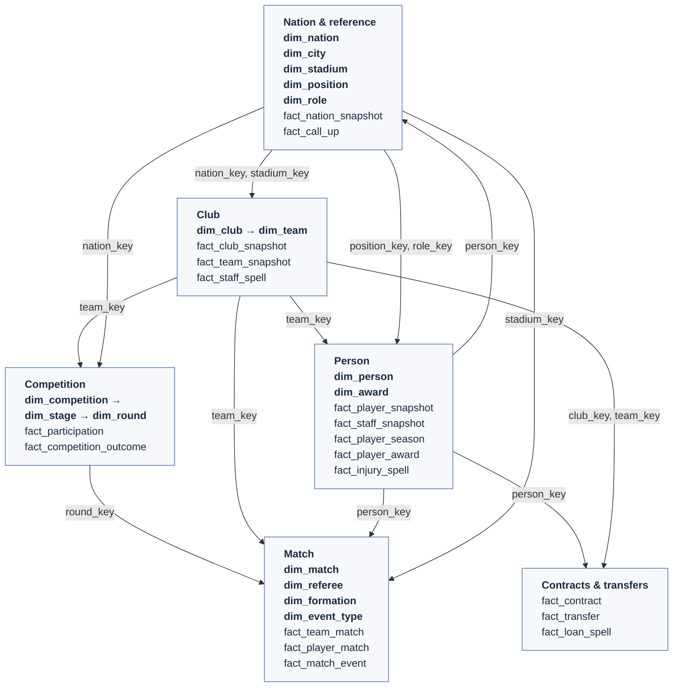

# Warehouse data model

The semantic model of the game, one doc per area. Conceptual only: names are not final tables.

| Doc | Covers |
|---|---|
| [`competition.md`](competition.md) | competition → stage → round, participation, outcomes, standings and ties as views |
| [`match.md`](match.md) | every match in the world, team / player / event grains, sources of truth for goals |
| [`club.md`](club.md) | club owns teams, club and team snapshots, staff spells |
| [`person.md`](person.md) | person with player and staff roles, snapshots, spells, seasons, awards |
| [`contract-transfer.md`](contract-transfer.md) | contracts, transfers, loans, at-club vs under-contract |
| [`nation.md`](nation.md) | the nation as a place and as a side, call-ups, rankings |
| [`reference.md`](reference.md) | position, role, city, stadium, currency |

## Overview

Each box is one area of the model (dimensions in **bold**, facts in plain). Arrows show the
shared key that joins one area to another. Time (`dim_date`, `dim_season`, `dim_snapshot_date`)
joins nearly everything and is left out. The table-by-table view is the bus matrix below; each
doc has its own detailed diagram.

## Bus matrix

Which dimensions each fact uses. Every fact also carries its time key (date, season or snapshot
date).

| Fact | person | team | club | match | competition / stage / round | nation | other |
|---|:-:|:-:|:-:|:-:|:-:|:-:|---|
| `fact_participation` | | ✓ | | | ✓ | | |
| `fact_competition_outcome` | | ✓ | | | ✓ (stage reached) | | |
| `fact_team_match` | | ✓ (+ opponent) | | ✓ | via match | | formation, manager |
| `fact_player_match` | ✓ | ✓ | | ✓ | via match | | position |
| `fact_match_event` | ✓ (+ secondary) | ✓ | | ✓ | via match | | event type, period |
| `fact_club_snapshot` | | | ✓ | | | | stadium |
| `fact_team_snapshot` | | ✓ | | | | | |
| `fact_staff_spell` | ✓ | | ✓ | | | | |
| `fact_player_valuation` | ✓ | | | | | | market value, reputation |
| `fact_player_state_scd` | ✓ | ✓ | | | | ✓ (nationality) | role, position, ratings, contract (SCD2) |
| `fact_player_snapshot` (view) | ✓ | ✓ | | | | ✓ (nationality) | role, position (valuation + SCD2 view) |
| `fact_staff_snapshot` | ✓ | | | | | | |
| `fact_player_season` | ✓ | | ✓ | | ✓ | | |
| `fact_player_award` | ✓ | | | | | | award |
| `fact_injury_spell` | ✓ | | | | | | |
| `fact_contract` | ✓ | | ✓ | | | | |
| `fact_transfer` | ✓ | | ✓ (from / to) | | | | |
| `fact_loan_spell` | ✓ | ✓ (borrowing) | ✓ (parent) | | | | |
| `fact_nation_snapshot` | | | | | | ✓ | |
| `fact_call_up` | ✓ | ✓ (national side) | | | | | |

`dim_match` itself references round, teams, stadium and referee. `dim_team` belongs to a
`dim_club`, and a national side is a club with `club_type = national`.

## Shared rules

- **Changing things are periodic snapshots or SCD Type 2 intervals**:
  - High-churn continuous metrics (e.g. transfer valuation, reputation) are periodic snapshots keyed by save date.
  - Slower-moving attributes, contracts, and registrations use SCD Type 2 intervals (`valid_from`, `valid_to`) to avoid data duplication across snapshots.
- **Things with a lifespan are spells** (contracts, loans, injuries, staff, call-ups).
- **One source per fact, the rest are checks**: scores come from the world fixture list, and
  events, the save's records, honours and league history check what we derive.
- **Team facts roll up to the club; club facts never split down.**
- **The warehouse keeps everything**, raw ability included. The immersion rule applies at the
  presentation layer.
