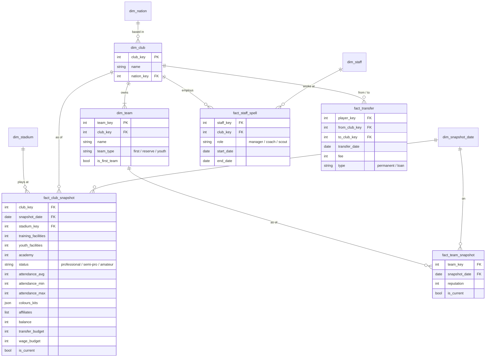

# Club — semantic model

Conceptual model only; names are not final tables. Links to [`competition.md`](competition.md)
and [`match.md`](match.md), where the **team** is the side that plays.

**Core idea:** a **club** owns one or more **teams** (Frem: first team 346, reserves 7296). The
club holds what the teams share (stadium, facilities, money, staff, contracts); a team holds what
each side has on its own (matches, competitions, reputation). Things that change are recorded as
**periodic snapshots** at each save date, with an `is_current` flag for convenience.

## Dimensions

| Dimension | Holds |
|---|---|
| `dim_club` | static identity: name, nation |
| `dim_team` | the side that plays: its club, team type, `is_first_team`. Every team has a club, even when a club has only one team. |
| `dim_snapshot_date` | the save dates, the project's `phase` |
| `dim_stadium`, `dim_staff`, `dim_nation` | the usual |

## What sits where

| Level | Holds | Why |
|---|---|---|
| **Club snapshot** | stadium, facilities, academy, status, attendance, colours and kits, finances, affiliates | shared: one ground, one training complex, one bank account |
| **Team snapshot** | reputation | each side has its own. **Assumed per team**; if the save turns out to hold one per club, it moves to the club snapshot. Club reputation is a view over the first team's value. |
| **Team facts** | matches, participation, competition outcomes | a *team* plays and enters competitions (see the competition and match docs) |
| **Club facts** | staff spells, transfers | staff are employed by the club; a transfer is club to club (first team ↔ reserves is not a transfer) |

**Rollup rule:** team facts roll up to the club through `club_key`. Club facts are **never split
down** to teams.

## Facts

- **Snapshots:** periodic, one row per club/team per save date. Finances are **semi-additive**:
  they can be summed across clubs, never across dates. `is_current` marks the latest snapshot
  and is reset on every load, so it always equals "latest snapshot date".
- **Staff spells:** staff × club × role, start/end. The manager on `fact_team_match` is looked up
  from here.
- **Transfers:** one row per move, and the club plays two roles (from / to), like home/away. A
  per-club in/out view gives it the `team_match`-style orientation.
- **Affiliates:** a list on the club snapshot; a change shows up between snapshots, and a count
  is the list's length. No separate fact.
- **Records:** **views** over our own facts (biggest win, top scorer). The save's club and player
  record tables only go back to 2020, the season before the career, so they hold nothing worth
  storing; they are **checks** against the derived views.
- **Competition history** is `fact_competition_outcome` from the competition model, rolled up
  to the club. It is not a separate fact here.

## Deferred

Squad membership (which team a player is in, loans, ownership) belongs to the player model.

"Us" is a club: the managed club owns both our teams.
