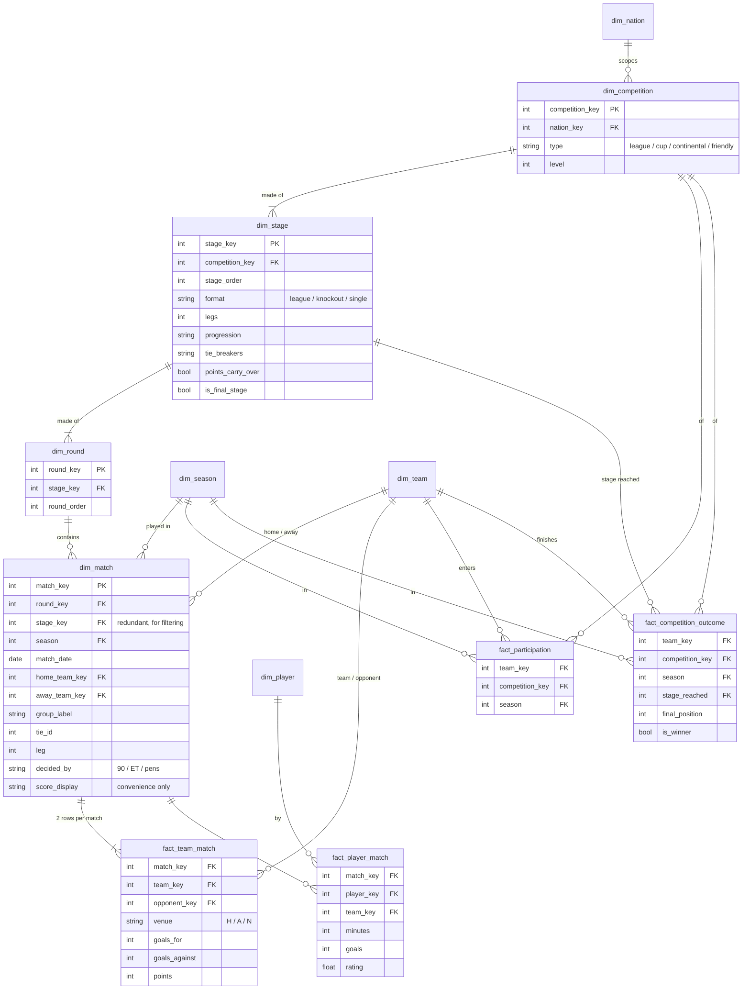
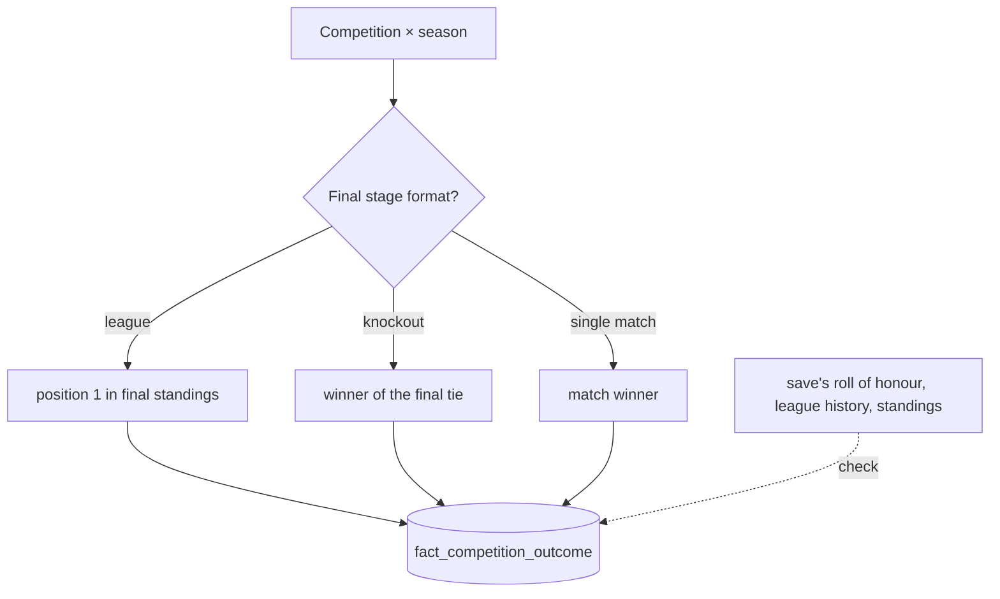

# Competition — semantic model

Conceptual model only; names are not final tables.

**Core idea:** a competition is a fixed sequence of **stages**. Each stage's **format** decides
what it produces: a league-format stage produces a ranking, and a knockout stage produces the
winners of its ties. **The winner is the outcome of the final stage.** Rules can change
between seasons (a round of 16 teams in 4 groups becomes 32 in 8), so a stage and a round are
keyed by the competition's own season label. (competition, season) is the grain shared by
participation, outcomes and standings.

## Decisions

- **Stage and round are separate tables.** The outcome's `stage_reached` needs a stage-grain key.
- **A match is a dimension.** It describes the game and several facts share it. The score lives
  on `fact_team_match`. `score_display` is for reading and is never summed.
- **Group, tie and leg are labels** on the match, not dimensions.
- **`fact_team_match` is one row per side**, so the team you ask about is always in one column.
  Count matches from `dim_match`, not from this table.
- **Given from the save:** participation, team-match and player-match. Everything else is derived.

## Views, not stored

- **`tie_results`**: matches grouped by `tie_id` → the two teams (team_a the first leg's home
  side), aggregate, the last leg's shoot-out, decided by and winner. A tie is decided once all
  its legs are played: on aggregate, then on the shoot-out. **There is no away-goals rule**:
  ties level on aggregate went to extra time whichever side had scored more away.
- **`standings`**: league and group stages. One row per team per matchday, the totals up to it
  (`through_date` is the latest match date they include), ranked by points, goal difference and
  goals scored. The stage's own tie-breakers are in its rules but not read yet, so Spain, which
  ranks level points by head to head, comes out wrong at ties (TODO #13). A stage holds only its
  own matches: a split league's groups are stages of their own. A stage with no rules member (a
  reserve group) is a league stage when its competition is typed a league or the league rule
  labelled it. Knockout stages use `tie_results` instead.

## Winner

Stored, so consumers don't re-derive it. **A league's final position is the game's own**
(`final_position`, from the club league history, which holds every finished league season
since the career began), because a table rebuilt from fixtures does not know each league's
tie-breakers or split-league rules. The rebuilt table gives `table_position` (the latest
matchday of the stage the team reached), which is all there is for a season in progress. A
knockout competition's winner is the winner of its final stage's last tie. `is_winner` is NULL
until the save decides it. The roll of honour, a check on both, is not extracted yet.

## Out of scope

Promotion/qualification links (you can derive them from participation plus `level`).

**Participation** is a team's competition seasons with a labelled match: a stage the save does
not let us label (a cup abroad, and a round of our own cups without one of our matches) counts
for nothing, so `fact_participation` under-counts there.

**Two-legged ties** are one round played twice, home and away swapped, the round marked
`legs = 2` in the rules; `dim_match` carries `tie_id` and `leg` (numbered by date).

**A fixture names its stage, not its competition** (no decoded field holds the link; TODO #6).
`dim_match.competition_source` says how a match's competition was found: one of our matches
in its stage (`our_match`), or the league rule `mart.league_tables` uses (`league_structure`:
a league's regular stage is a multi-matchday stage at index 0, its split groups the season's
other stages wholly inside its clubs). The rule is a heuristic, exact for Denmark and the
Premier League, wrong for Spain (TODO #13). Other stages (cups abroad) have no competition.
