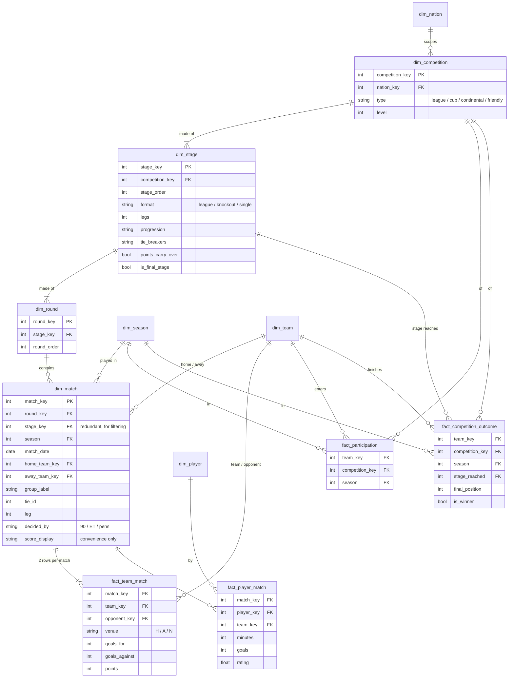
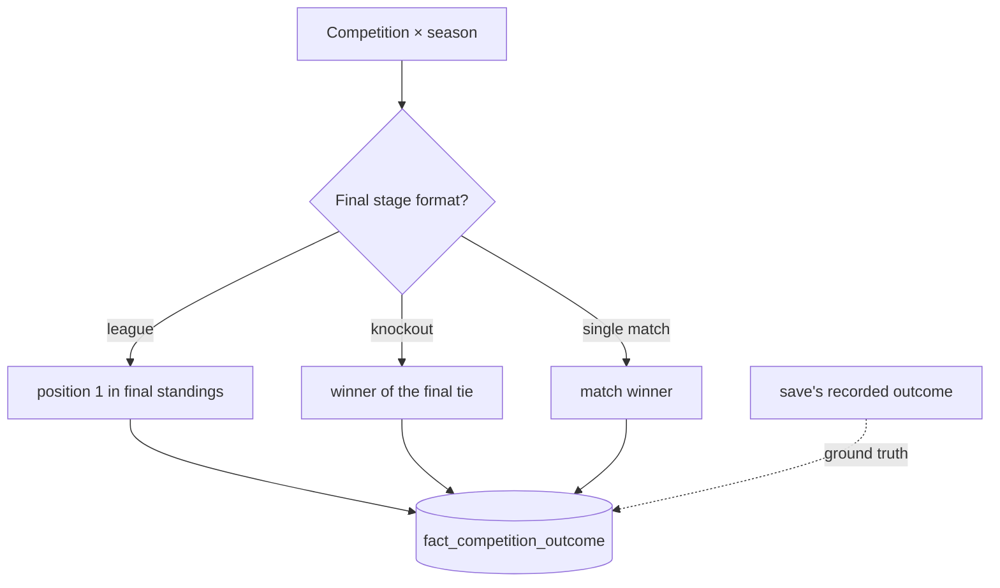

# Competition — semantic model

Conceptual model only; names are not final tables.

**Core idea:** a competition is a fixed sequence of **stages**. Each stage's **format** decides
what it produces: a league-format stage produces a ranking, and a knockout stage produces the
winners of its ties. **The winner is the outcome of the final stage.** Rules are fixed per
competition in FMM, so **season is only a key**. (competition, season) is the grain shared by
participation, outcomes and standings.

## Decisions

- **Stage and round are separate tables.** The outcome's `stage_reached` needs a stage-grain key.
- **A match is a dimension.** It describes the game and several facts share it. The score lives
  on `fact_team_match`. `score_display` is for reading and is never summed.
- **Group, tie and leg are labels** on the match, not dimensions.
- **`fact_team_match` is one row per side**, so the team you ask about is always in one column.
  Count matches from `dim_match`, not from this table.
- **Given from the save:** participation, team-match and player-match. Everything else is derived.

## Views, not stored

- **`tie_results`**: matches grouped by `tie_id` → aggregate, winner, decided by.
- **`standings`**: league-format stages only. Cumulative team-match rows ranked by the stage's
  tie-breakers, keyed by date as well as round. Knockout stages use `tie_results` instead.

## Winner

Stored, so consumers don't re-derive it. Where the save records outcomes (the standings record,
[`../standings-record.md`](../standings-record.md)), the save is the source and our derivation
is the check.

## Out of scope

Rules per season, promotion/qualification links (you can derive them from participation plus
`level`), and match detail (next ticket).

**Open question:** does the save store a two-legged tie as one round with a leg number, or as
two rounds? Check `mart.match_stages`.
