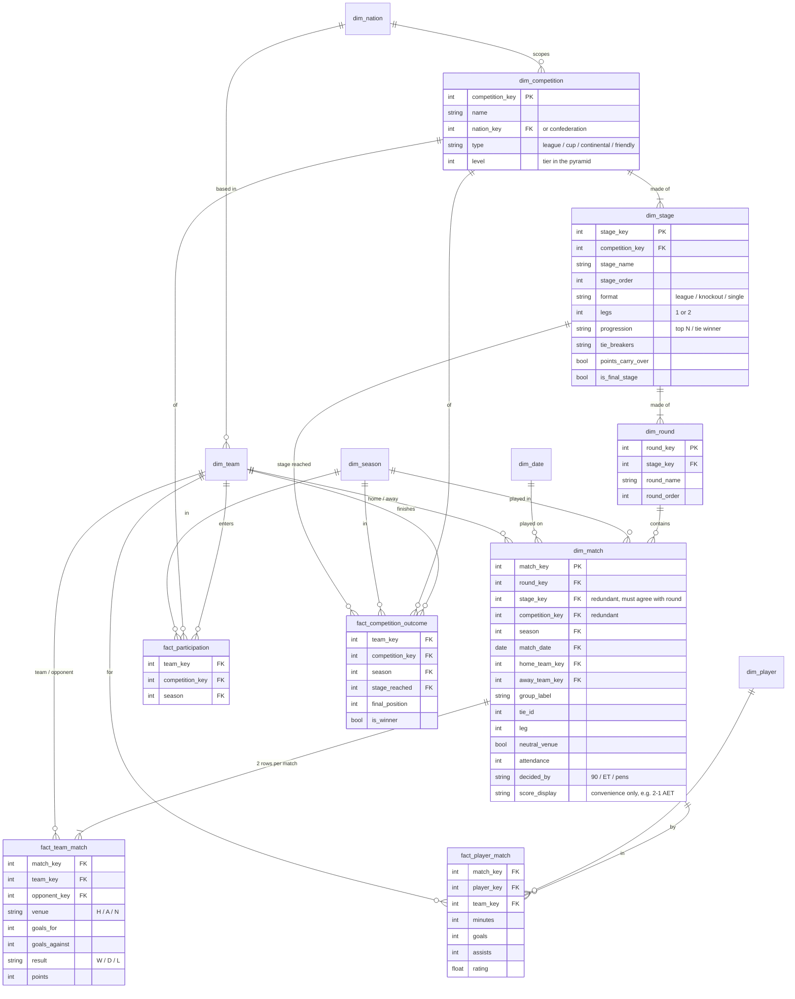
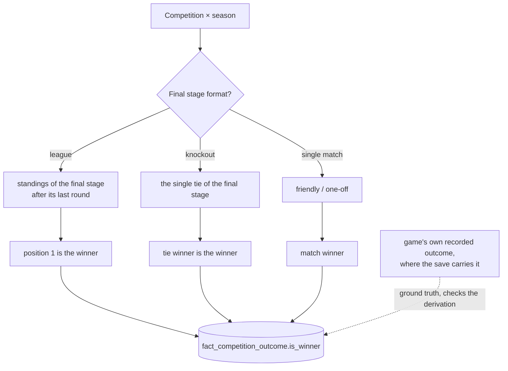

# Competition — semantic model

What a competition *is* in the mart, before any table is built. This is the semantic layer:
entities, grains, keys and where each fact comes from. Table and column names here are
conceptual; the implementation is a later ticket.

## The idea in one paragraph

A competition is a fixed sequence of **stages**, and each stage has a **format** that decides
what it produces: a league-format stage produces a *ranking*, a knockout stage produces *tie
winners*. Progression rules chain the stages together. **The competition winner is the outcome
of the final stage** — one rule for every competition, whether it is a straight league, a cup,
a league-then-finals (A-League), a league-then-split (Superliga), or qualifiers → groups →
knockouts (Champions League). A friendly is the degenerate case: one stage, one match.

In FMM the rules never change between seasons, so the format belongs to the competition and its
stages, defined once. **Season still matters**, but only as a key: a (competition, season) pair
is the grain that participation, outcomes and standings share. It is not an entity of its own.

## The hierarchy

```
Nation / Confederation
└─ Competition                (scope, level, type)
   └─ Stage                   (format, legs, progression, tie-breakers, is_final_stage)
      └─ Round                (matchday / "Round of 16")
         └─ Match             (+ group, tie and leg as labels)
```

- **Group** ('Group D', 'Championship Group') is a mini-league inside a stage. It has no
  attributes beyond its name, so it is a label on the match, not a dimension.
- **Tie** is the knockout pairing — one match, two legs, or a match plus a replay. Also a label
  (`tie_id` + `leg`) on the match; its result is derived by grouping the matches that share it.

## Diagram



## Dimensions

| Dimension | Grain | Carries |
|---|---|---|
| `dim_nation` | nation | name, confederation |
| `dim_team` | team | name, nation, club or national side |
| `dim_competition` | competition | nation/confederation scope, type, **level** (the tier — kept so promotion/relegation can be *derived* later without modelling it) |
| `dim_stage` | stage of a competition | format, legs, progression rule, tie-breakers, points carried over, `stage_order`, **`is_final_stage`**. The rules live here, once. |
| `dim_round` | round of a stage | name, order. Nothing else. |
| `dim_match` | match | everything that *describes* a match: date, season, round (+ stage, competition), home and away team, group, tie, leg, venue, attendance, how it was decided, and a **display score** for convenience |
| `dim_season` | season (end year) | start/end date, from the career's rollover day |
| `dim_date`, `dim_player` | day, player | the usual |

**Stage and round are separate, not flattened.** Two facts are naturally at *stage* grain —
"reached the quarter-finals", "entered at the third qualifying round" — and a separate
`dim_stage` gives them a proper key instead of pointing at an arbitrary round row.
`dim_match` carries both `round_key` and a redundant `stage_key`, because "league matches only"
and "knockout matches only" are the commonest filters.

**A match is a dimension, not a fact.** Almost everything on it is descriptive, and it is shared
by several facts (team-match, player-match, and later events and ratings). The score is a
measure, so it lives on `fact_team_match`; `dim_match.score_display` repeats it purely for
reading and is never summed.

## Facts

| Fact | Grain | Source | Notes |
|---|---|---|---|
| `fact_participation` | team × competition × season | **given** — the save lists each season's entrants | factless. Present before a ball is kicked, which is why season is a key here and not read off a match. How a team got in (promotion, qualification) is not modelled. |
| `fact_team_match` | team × match | **given**, oriented | each match twice, once from each side. Team is always *one* column, so "our goals" is `SUM(goals_for) WHERE team = Frem` and home goals is one more `WHERE`. **Count matches from `dim_match`**, never here — summing both sides double-counts. |
| `fact_player_match` | player × match | **given** | rolls up to player × competition × season |
| `fact_competition_outcome` | team × competition × season | **save where it has it**, derived otherwise | where the winner lives, plus `stage_reached` and `final_position` |

### Derived, not stored — views over the facts

| View | Grain | Rule |
|---|---|---|
| `tie_results` | tie | group `dim_match` + `fact_team_match` on `tie_id`: aggregate, winner, decided by (aggregate / away goals / ET / pens) |
| `standings` | team × stage (× group) × as-of | **league-format stages only.** Cumulative sums of `fact_team_match` up to a point, ranked by the stage's tie-breakers, plus points carried over where the stage says so. A knockout stage has no table — its equivalent is `tie_results`. |

Standings are a view because a position is a **rank across every team**, not an additive
measure — it depends on everyone else's rows and on the stage rules, so storing it would
duplicate a calculation, not record a fact. Key it by **date** as well as round: postponements
mean "after matchday 20" and "on 1 January" are different tables, and the second is usually the
question.

## How the winner is decided



The rule is always *the outcome of the stage where `is_final_stage` is true*; what varies is only
that stage's format, and since stages are fixed per competition, that is settled once per
competition, not per season. The outcome is **stored**, so no consumer has to know which branch
applies. Where the save records the result itself — the decoded-but-unimplemented standings
record ([`../standings-record.md`](../standings-record.md)) gives every club's final league
position — it is the source and the derivation is the check against it, never the other way
round.

## Given vs derived

Only **participation, team-match (from the match list) and player-match** come in from the save.
Everything else is built from them plus the rules on `dim_stage`. So when a table or an outcome
looks wrong, the fault is in a derivation or a missing stage rule — never in an input.

## Deliberately out of scope

- **Rules per season** — FMM's competition rules are fixed, so there is no edition entity.
- **Links between competitions** (promotion, relegation, qualification paths). The participant
  list is given; movement can be derived from participation across seasons plus
  `dim_competition.level` if it is ever wanted.
- **Match detail** (events, ratings, lineups) — the next ticket, hanging off `dim_match`.

## Against today's mart

Several of these exist in some form already; compare before building:

| This model | Nearest today |
|---|---|
| `fact_team_match` | `mart.club_matches` (already oriented per club) |
| `dim_match` stage / group / tie / leg labels | `mart.match_stages` (from each competition's rules member) |
| `standings` | `mart.league_tables` (rebuilt from the fixture list; verified for Denmark only) |
| `fact_player_match` rolled up | `mart.player_seasons` |

Open question for the match ticket: whether the save records a two-legged tie as **one round
with a leg number** or **two rounds**. If two, `tie_id` links matches across rounds and a tie
takes its later round's key. `mart.match_stages` will show which.
