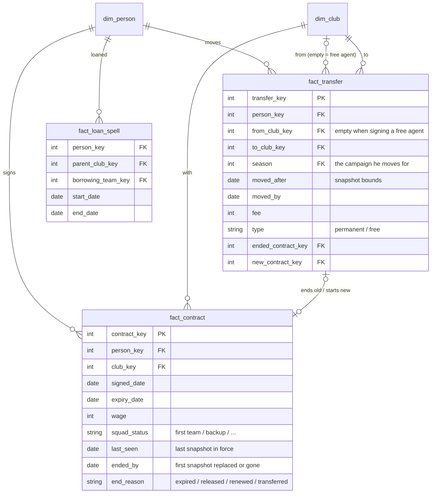

# Contracts & transfers — semantic model

Conceptual model only; names are not final tables. Builds on [`person.md`](person.md) and
[`club.md`](club.md).

**Core idea:** a **contract** binds a player to a club and is never changed, only replaced. A
**transfer** is a move between clubs that ends one contract and starts the next. **Being at a
club and holding a contract are separate facts**: a player can stay on a club's books after his
contract has expired. A **loan** is neither; it is a spell on top of an unchanged contract.

## Contracts

- **Players only.** Staff have no contract data; their presence at a club is a staff spell.
- **One row per contract**: club, signed and expiry dates, wage, **squad status** (a contract
  term: it cannot change mid-contract), and how it ended.
- **Filled in as it goes** (an accumulating snapshot): signed → `last_seen` → `ended_by` →
  `end_reason`.
- **End dates are bounds.** `last_seen` is the last snapshot the contract was in force,
  `ended_by` the first where it was replaced or gone. The real end falls between them;
  `ended_by` is the working date. A signed date on the replacement contract, where the save has
  one, is the exact end.
- **Rebuilt from snapshots:** contracts cannot change, so a different club, expiry, wage or squad
  status between snapshots always means a new contract.
- **A loan never creates a contract** at the borrowing club.

## At a club vs under contract

| State | On a club's books | Contract covering the date |
|---|---|---|
| Under contract | yes | yes |
| **Expired, still at the club** | yes | no |
| Free agent | no | no |

**A contract ending is not the player leaving.** An expired contract ends with `expired`; the
player leaves later, when he is released or walks away, and that ends his spell at the club.
The player snapshot carries this as a derived `contract_status`.

## Transfers

- **What counts:** a move between clubs that ends one contract and starts another.
  - **permanent**: a fee is paid.
  - **free**: fee 0. A Bosman / pre-contract move has `from_club` set; signing an unattached free
    agent leaves `from_club` empty. No extra type is needed to tell them apart.
- **Loans are not transfers.** They stay in `fact_loan_spell`; an "all moves" view unions the two
  for a career timeline.
- **Club level only.** Which team the player joins comes from the player snapshot.
- **Dates are approximate:** the season he moves for, plus the snapshot window it happened in.
- **Per-club view:** in/out with a signed fee (+ sold, − bought), so net spend is one `SUM`, the
  same orientation idea as `fact_team_match`.

## Checks, not stored

The save repeats some of this in other places. Those values are **not stored again**. They are
used to check that the model agrees with itself:

- **Transfer ↔ contract:** every transfer ends a contract with `end_reason = transferred` and
  starts one at `to_club`, and every contract ended by transfer has a transfer.
- **Contracted flag** in the save ↔ derived `contract_status`.
- **"Loaned out" squad-status code** in the save ↔ a loan spell covering the date.
- **Expiry passed** ↔ `contract_status` is expired or the player has left.
