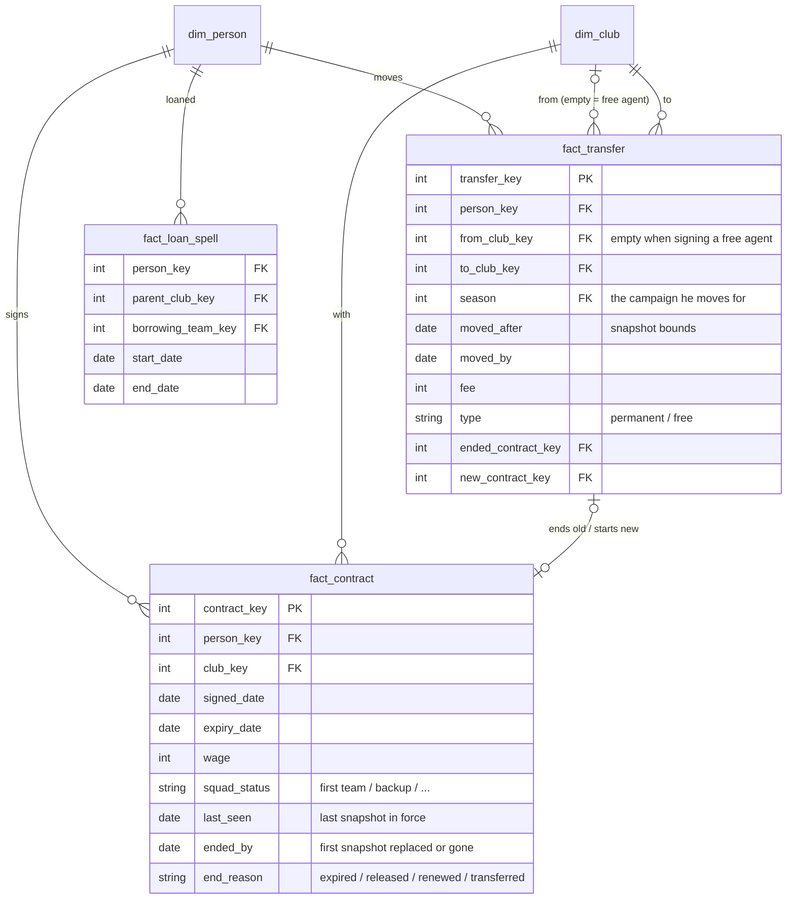

# Contracts & transfers — semantic model

Conceptual model only; names are not final tables. Builds on [`person.md`](person.md) and
[`club.md`](club.md).

**Core idea:** a **contract** binds a player to a club and is never changed, only replaced. A
**transfer** is a move between clubs that ends one contract and starts the next. **Being at a
club and holding a contract are separate facts**: a player can stay on a club's books after his
contract has expired. A **loan** is neither; it is a spell on top of an unchanged contract.

## Contracts

- **Players only.** Staff have no contract data; their presence at a club is a staff spell.
- **One row per contract**: club, signed and expiry dates, wage, **squad status** (a contract
  term: it cannot change mid-contract), and how it ended.
- **Filled in as it goes** (an accumulating snapshot): signed → `last_seen` → `ended_by` →
  `end_reason`.
- **End dates are bounds.** `last_seen` is the last snapshot the contract was in force,
  `ended_by` the first where it was replaced or gone. The real end falls between them;
  `ended_by` is the working date. A signed date on the replacement contract, where the save has
  one, is the exact end.
- **Rebuilt from snapshots:** contracts cannot change, so a different club, expiry, wage or squad
  status between snapshots always means a new contract.
- **A loan never creates a contract** at the borrowing club.

## At a club vs under contract

| State | On a club's books | Contract covering the date |
|---|---|---|
| Under contract | yes | yes |
| **Expired, still at the club** | yes | no |
| Free agent | no | no |

**A contract ending is not the player leaving.** An expired contract ends with `expired`; the
player leaves later, when he is released or walks away, and that ends his spell at the club.
The player snapshot carries this as a derived `contract_status`.

## Transfers

- **What counts:** a move between clubs that ends one contract and starts another.
  - **permanent**: a fee is paid.
  - **free**: fee 0. A Bosman / pre-contract move has `from_club` set; signing an unattached free
    agent leaves `from_club` empty. No extra type is needed to tell them apart.
- **Loans are not transfers.** They stay in `fact_loan_spell`; an "all moves" view unions the two
  for a career timeline.
- **Club level only.** Which team the player joins comes from the player snapshot.
- **Dates are approximate:** the season he moves for, plus the snapshot window it happened in.
- **Per-club view:** in/out with a signed fee (+ sold, − bought), so net spend is one `SUM`, the
  same orientation idea as `fact_team_match`.

## Checks, not stored

The save repeats some of this in other places. Those values are **not stored again**. They are
used to check that the model agrees with itself:

- **Transfer ↔ contract:** every transfer ends a contract with `end_reason = transferred` and
  starts one at `to_club`, and every contract ended by transfer has a transfer.
- **Contracted flag** in the save ↔ derived `contract_status`.
- **"Loaned out" squad-status code** in the save ↔ a loan spell covering the date.
- **Expiry passed** ↔ `contract_status` is expired or the player has left.

## As built (data-layers step 16)

Keys are natural: a person is `person_id` (`<tid>-<dob>`), a contract `(person_id,
first_seen_date)`, a transfer `(person_id, to_line_index)`. Every rule below was measured on the
step-16 gate stores (Frem 2021-06-27 / 2023-07-02 / 2026-06-11 and 2023-06-29 / 2027-06-29 /
2027-08-09; Bucaspor 2023-04-01).

| Table | Grain | Notes |
|---|---|---|
| `fact_contract` | `person_id`, `first_seen_date` | a run of snapshots whose current contract keeps one stored start date at one club; `start_date`, wage, expiry and team (first and last seen), `last_seen_date` / `ended_by_date`, `end_reason` |
| `fact_transfer` | `person_id`, `to_line_index` | each club change in the career history (loan lines skipped) plus the club on his newest snapshot, and each graduation from a youth side; fee from the seller's line; snapshot bounds, `move_date` and the two contracts for a move the store watched |
| `fact_loan_spell` | `person_id`, `season`, `borrowing_club_tid` | loan lines and squad listings; parent club; real dates for our own loans out |
| `fact_staff_spell` | `person_id`, `first_seen_date` | runs of snapshots on one team's books in one role (`manager` / `staff`) |
| `squad_membership` (view) | `person_id`, `snapshot_date`, `team_tid` | who each squad array lists, with the club his record names and `is_loan_in` |

**The contract's stored start date is the day it was signed: its identity, and the exact end of
the one before.** A new contract starts the day it is signed (the game's rule, Zac).
`stg_contracts.start_date` is that date, `fact_contract.signed_date`:
- A contract whose start date is unchanged between two snapshots keeps it through changes of
  wage and of team within the club; a new start date always falls between the two snapshots
  that bound it: on every successor contract, 64,749 of 64,750 inside
  `(last_seen, first_seen]` and the last on the earlier snapshot's own day (signed after that
  save was made). So a different start date is a new contract, and a different wage or team
  is not (the model above said any change of terms was).
- The day-one save is the exception: the game's starting database holds start dates up to eight
  months ahead on 10,445 current contracts already in force (10,443 of the rebuilt contracts),
  clustered on 1 July 2021 and the window ends, and 7,733 of their players' joined dates are as
  far ahead. Those are not when the contracts were signed; `signed_date` reads NULL there
  (`stored_signed_date` keeps the value). No later save holds a future start date.
- The data agrees with the rule and cannot contradict it. Renewals start on every day of the
  year (on Frem A: May 10,510, April 3,847, July 3,578, September 2,311, January 2,194…), not on
  season starts. A free move at a contract's end gets a new contract starting the day he joined,
  never months before (16 of ~6,000 start earlier), so a deal agreed and completed later is not
  seen: the grid holds a contract only once it is current, and for a transfer the signing and
  the start are one day.

**Squad status is not a contract term.** The training row's squad status changes under one
start date on 1,996 of 3,893 contracts seen more than once (Frem A) and 2,599 of 21,605 (Frem B),
so it stays on `fact_player_snapshot`. Wage changes under one start date on 225 and 330 of them,
expiry on 3 and 6, team (within the club) on 544 and 1,919; all three are kept first and last.

**Transfers.** The fee code sits on the selling club's last line before the move; a loan's
`loan` code on the borrowing club's line. A move made during a season has no buying-club line
until the season ends, so the club on the newest snapshot closes each history.

**Graduations.** A club's youth side has no club record; its tid is the u16 complement of its
club's (`65535 - club_tid`: Frem 346 → "Frem Yth" 65189, FCK 344 → 65191; `mart.youth_clubs`,
[`homegrown-derivation.md`](../agent-context/homegrown-derivation.md)), and it appears on its
products' first line with a fee code not understood. A youth line counts for its club
(`youth_team_tid` keeps the academy). The move from it into the club's own senior side is a
**graduation** (`transfer_type = 'graduation'`, no fee, from and to club the same). On Frem A
3,082 graduations (2,008 from the history, 1,074 academy products whose only line is the youth
one, seen at their club on the newest snapshot), and 47 products who went straight to another
club, a move from the academy's club; on B 4,976 and 64; on Bucaspor 272 and 19. Every academy
resolves to its club the same way `mart.youth_clubs` does (3,129/3,129, 5,040/5,040,
291/291). No snapshot shows a player on a youth side's books, so a graduation is dated by its
season only.

**Joined dates.** `joined_date` lies between the two snapshots of every club change measured
(13,473/13,473), but **the game resets it when a player returns from a loan** (confirmed in game
on Matteo Grosso, Ruben Minerba and Frederik Ellegaard, all of whose records carry a loan-return
date), so it is `move_date` only where the buying club did not loan him out between the move's
season and that date, and the date lies within a season of the move's. Seasons confirmed in
game: Grosso's free move from Brøndby is 2024/25 (his Frem line shows "Bos"), as the history
says; Frederik Balslev's £1K to Hvidovre is right (a loan with an option to buy).

A free agent whose contract ran out in June and who signs in July is labelled by the game with
the season just ended, and the history often has no Free-agent line for the gap:
`from_club_tid` is then the club whose contract ran out and `was_free_agent` says the snapshot
before the move showed him without a club.

**Loans.** The game can remove a loan year's 0-app parent line once the season ends (it keeps
them for some players: Johan Maarup's Frem lines stand beside each of his loans), so the line
before a loan can name the club before the parent. The parent is the listing's record club,
else our club where Player Progress flags him on loan that season, else the club a later
snapshot shows him at with a joined date before the loan's season, else the line before.
Player Progress's on-loan weeks mark only loans out (no run overlaps a loan to us) and can run
past the rollover day (Bucaspor's to 28 June, its rollover 20 June), so a run is cut at a season
boundary only where a loan of ours in the next season meets it. Two loans of ours in one season
get no dates (Maarup's 2026/27 shows AB and a 0-app FC Botoşani line, the loan he went on
next), since the runs cannot be told apart.

**Staff.** A club's staff array lists its coaches, not its manager: the manager is the person
with a staff record on a team's books whom its array does not list, the higher home reputation
where two are not (`manager_candidates`). It names the same manager as the old
`mart.club_managers` on every snapshot of the gate stores.

**Seasons from dates** use the career's rollover day, which the loader now records in the store
(`raw.app_config.career_rollover`, from `careers.py`) for the `season_of` / `season_start` /
`season_end` macros. TODO #11 still wants it read from the game.

### Checks (reported, not stored)

| Check | Frem A | Frem B | Bucaspor |
|---|---|---|---|
| contract ended by a transfer has a transfer naming it | 11,338 / 12,523 | 8,564 / 11,056 | (one snapshot) |
| the rest: net moves through a club no snapshot saw (A→B→C between two snapshots; the history names B→C) | 1,185 | 2,492 | |
| a watched transfer starts a contract at the buying club | 13,460 / 13,472 | 11,320 / 11,331 | |
| the rest: no contract on record on `moved_by` | 12 | 11 | |
| the save's contracted flag on a free agent (no club, no contract) | 708 | 1,014 | 170 |
| contracted flag with no contract slot marked current | 231 | 199 | 192 |
| status 65 ("loaned out") snapshots listed on loan by another club | 33 / 442 | 17 / 579 | 17 / 454 |
| listed loanees whose status is not 65 | 4,749 | 1,936 | 2,607 |

Status 65 does not mark a loan in most rows; TODO #4 has it as an unread code.

Not built: a staff member's job beyond manager / staff (the save names none), and loan dates
for any club but ours (the save gives none).
