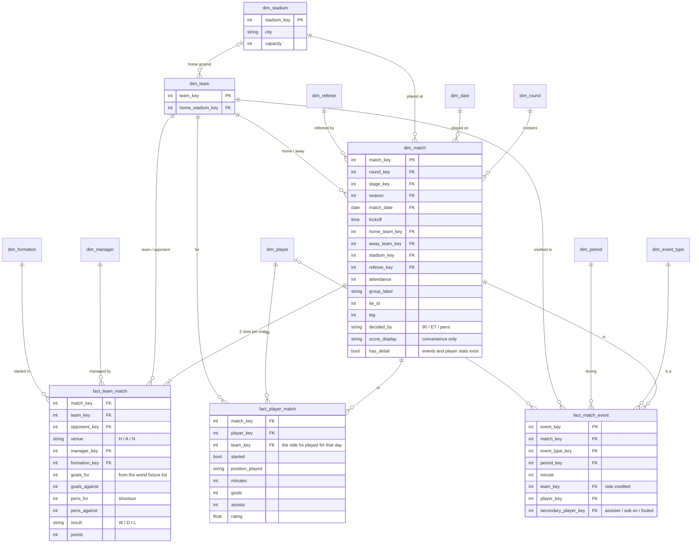

# Match — semantic model

Conceptual model only; names are not final tables. Builds on
[`competition.md`](competition.md): a match belongs to a round, and through it to a stage and a
competition.

**Core idea:** a match is a **dimension**. It is one game at one time, place and round, and
every match-level fact hangs off it. What happens in the game is recorded at three grains:
**team × match** (one row per side), **player × match** (the lineup and each player's stats) and
**event** (goals, cards, subs, shootout kicks, each with a minute and a period).

**Every match in the world is in `dim_match`**, but only ours carry detail. The world fixture
list (`fix_man`) gives every match its date, teams and score; events, player stats and lineups
exist only for matches we play. `has_detail` says which is which, so a world match with no events
is never read as a match with no goals.

## Dimensions

| Dimension | Holds |
|---|---|
| `dim_match` | round (+ stage, competition), season, date + kick-off, home/away team, stadium, referee, attendance, group/tie/leg labels, how it was decided, display score |
| `dim_stadium` | name, city, capacity |
| `dim_team` | adds `home_stadium_key`. **Neutral venue is derived**: the match stadium isn't the home team's ground. |
| `dim_referee` | match official: name, nation |
| `dim_manager` | each side's manager on the day |
| `dim_formation` | shape, e.g. 4-2-3-1 |
| `dim_event_type` | goal, own goal, shootout kick, card, sub, injury… (the loader already seeds `raw.event_types`) |
| `dim_period` | 1st half, 2nd half, ET 1st, ET 2nd, shootout |
| `dim_player`, `dim_date` | the usual |

## Decisions

- **Formation and manager are per side**, so they go on `fact_team_match`, not on the match.
  A change during the game is an event.
- **"Match overall stats" is `fact_team_match`.** The whole-match total is a view over its two
  rows, not a separate fact.
- **Period and minute belong to events**, not to the match.
- **Kick-off time is an attribute**, not a dimension.
- **A player's team comes from the match**, not from the player, because players change clubs.

## Sources of truth for goals

| Question | Source | Why |
|---|---|---|
| The scoreline | **the world fixture list (`fix_man`)** → `fact_team_match.goals_for/against`, the final score (after extra time where there was any; the fixture holds both) | one source for every match in the world, ours included, so scores are consistent everywhere |
| Who scored, and when | **events** | only events carry **own goals** (credited to the other side, with no player tally) and **shootout kicks** |
| A player's goal tally | events, excluding own goals and shootout kicks | a shootout kick isn't a goal |
| Shootout result | the world fixture list → `pens_for/against`; events give who took each kick | the fixture list carries shootout scores for every match |

Events are a **check** on the score: for every match with detail, goal events per side (outside
the shootout) must equal the fixture-list score. The fixture list is the trusted side, so a
mismatch is investigated on the events side and never overwrites the score.

## As built (data-layers step 14b)

- **`match_id`** keys every match table: the match's date and its two teams packed into one
  BIGINT, `yyyymmdd × 10¹⁰ + home_tid × 10⁵ + away_tid` (Salzburg v Frem on 2027-07-28 is
  `202707280012500346`; `macros/match_id.sql`). It is the same in every snapshot and rebuild,
  sorts by date and reads back by eye. `dim_match` holds the date and teams; the facts carry
  `match_id` only, and `dim_match` tests that every tid stays below 10⁵.
- **`fact_player_match.minutes`** runs from kick-off, or the minute a player came on, to the
  minute he went off, was sent off or the match ended: 90, or 120 when the match went to extra
  time or penalties. A dismissal is in the events only (`dim_event_type.ends_appearance`).
  Stoppage time is not counted. `started` is a place in the XI, `appeared` a start or a
  substitution on. `position` uses `dim_position`'s codes (the match table's `FC` is `ST`).
- **`fact_match_event`** reads each event's side from the save: `player_team_tid` is the
  player's team and `team_tid` the side the event counts for, the other side for an own goal
  (`dim_event_type.scores_for`). `period` is the one the minute falls in (`dim_period`: first
  half to 45, second to 90, extra time to 105 and 120); stoppage time stays in the period it
  extends, and a shoot-out kick is the `shootout` period.
- **Checks** on the gate stores: goal events per side equal the fixture-list score on every
  match with detail, and each player's `goals` equals his goal events on every line.

## Out of scope

Stats beyond goals (which column each comes from is decided per stat when it is built) and
in-match tactics.
