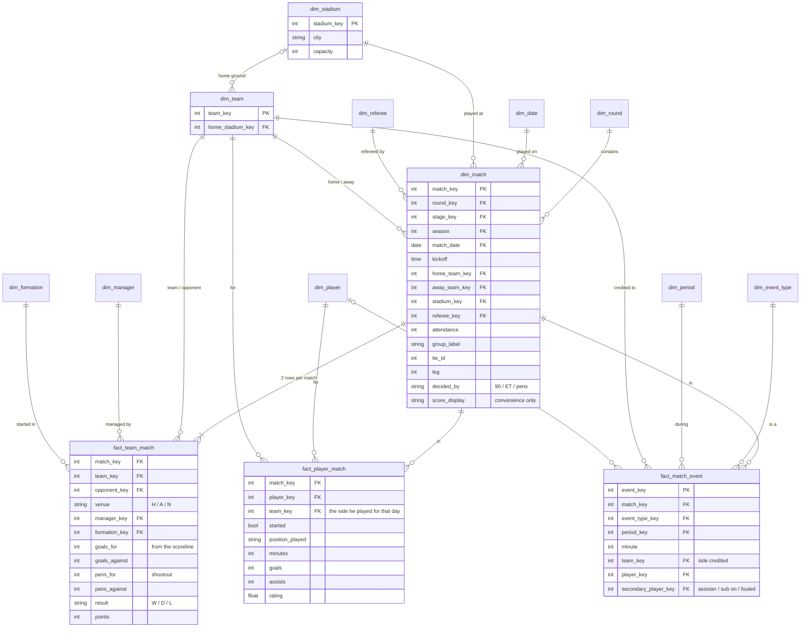

# Match — semantic model

Conceptual model only; names are not final tables. Builds on
[`competition.md`](competition.md): a match belongs to a round, and through it to a stage and a
competition.

**Core idea:** a match is a **dimension**. It is one game at one time, place and round, and
every match-level fact hangs off it. What happens in the game is recorded at three grains:
**team × match** (one row per side), **player × match** (the lineup and each player's stats) and
**event** (goals, cards, subs, shootout kicks, each with a minute and a period).

## Dimensions

| Dimension | Holds |
|---|---|
| `dim_match` | round (+ stage, competition), season, date + kick-off, home/away team, stadium, referee, attendance, group/tie/leg labels, how it was decided, display score |
| `dim_stadium` | name, city, capacity |
| `dim_team` | adds `home_stadium_key`. **Neutral venue is derived**: the match stadium isn't the home team's ground. |
| `dim_referee` | match official: name, nation |
| `dim_manager` | each side's manager on the day |
| `dim_formation` | shape, e.g. 4-2-3-1 |
| `dim_event_type` | goal, own goal, shootout kick, card, sub, injury… (the loader already seeds `staging.event_types`) |
| `dim_period` | 1st half, 2nd half, ET 1st, ET 2nd, shootout |
| `dim_player`, `dim_date` | the usual |

## Decisions

- **Formation and manager are per side**, so they go on `fact_team_match`, not on the match.
  A change during the game is an event.
- **"Match overall stats" is `fact_team_match`.** The whole-match total is a view over its two
  rows, not a separate fact.
- **Period and minute belong to events**, not to the match.
- **Kick-off time is an attribute**, not a dimension.
- **A player's team comes from the match**, not from the player, because players change clubs.

## Sources of truth for goals

| Question | Source | Why |
|---|---|---|
| The scoreline | **the save's recorded score** → `fact_team_match.goals_for/against` | sourced directly, so it doesn't depend on the events being complete |
| Who scored, and when | **events** | only events carry **own goals** (credited to the other side, with no player tally) and **shootout kicks** |
| A player's goal tally | events, excluding own goals and shootout kicks | a shootout kick isn't a goal |
| Shootout result | events (period = shootout) → `pens_for/against` | not in player stats |

The two sources check each other: for every match, goal events per side (outside the shootout)
must equal the recorded scoreline. A mismatch means events are missing or misattributed, never
a reason to overwrite the score.

## Out of scope

Stats beyond goals (which column each comes from is decided per stat when it is built) and
in-match tactics.
