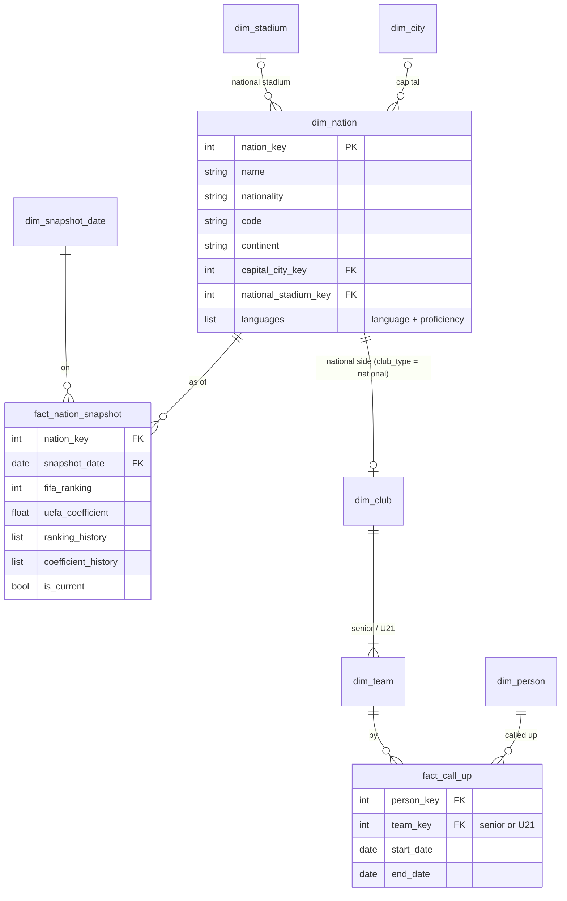

# Nation — semantic model

Conceptual model only; names are not final tables. Builds on [`club.md`](club.md) and
[`person.md`](person.md).

**Core idea:** a nation is two things. It is a **place** (a dimension that clubs, people,
stadiums and competitions belong to), and it **fields teams**. Its senior side and U21 work like
a club's teams: the save stores national teams in the club table, club-shaped. The one real
difference is that players are **called up**, not contracted.

## The nation as a place

- **`dim_nation`**: name, nationality ("Danish"), code, continent, capital city, national
  stadium.
- **Languages spoken** with proficiency (Denmark: Danish 100, English 70, Swedish 50): a list on
  the dimension, the same shape as a player's languages.
- **Continent** is an attribute, not a dimension of its own.

## Rankings and coefficients

- **`fact_nation_snapshot`**: nation × snapshot date, holding the current FIFA ranking and UEFA
  coefficient (only European nations have one).
- The save hands over each nation's **history** as a list (coefficients oldest first; the last
  entry is the season in progress and reads 0). Carried as lists on the snapshot, the same as a
  club's affiliates.

## National teams

- A nation's teams are a **`dim_club` with `club_type = national`**, linked to its nation, with
  a senior and an U21 `dim_team` under it. Everything team-level (matches, participation,
  competition outcomes) works unchanged.
- **Call-ups replace contracts**: `fact_call_up` is a spell, person × national team × dates.
- **Caps and goals** (senior and U21) are given directly, so they are columns on the player
  snapshot rather than derived.

## To confirm

National-team play hasn't been explored in this career yet. Whether the save records call-ups as
dated spells, or only current squad membership per snapshot, decides whether `fact_call_up`
holds spells or becomes a squad list on the snapshot.
