# Person — semantic model

Conceptual model only; names are not final tables. Links to [`club.md`](club.md) (transfers,
staff spells) and [`match.md`](match.md) (player match performance).

**Core idea:** the entity is a **person**. **Player** and **staff** are roles, and one person
can hold both at once (a player-manager). Static biography sits on the person. Everything that
changes (attributes, value, reputation, nationality, languages, team) is a **periodic snapshot**
per role. Things with a lifespan (contracts, loans, injuries) are **spells**.

**The warehouse keeps everything**, raw ability (CA/PA) included. The immersion rule applies
where data reaches a user (the site, user-facing marts), not here.

```mermaid
erDiagram
    dim_person        ||--o{ fact_player_snapshot : "as a player"
    dim_person        ||--o{ fact_staff_snapshot : "as staff"
    dim_snapshot_date ||--o{ fact_player_snapshot : "on"
    dim_snapshot_date ||--o{ fact_staff_snapshot : "on"
    dim_team          ||--o{ fact_player_snapshot : "in team"

    dim_person        ||--o{ fact_contract : "signs"
    dim_club          ||--o{ fact_contract : "with"
    dim_person        ||--o{ fact_loan_spell : "loaned"
    dim_club          ||--o{ fact_loan_spell : "parent"
    dim_team          ||--o{ fact_loan_spell : "borrowing team"
    dim_person        ||--o{ fact_injury_spell : "suffers"
    dim_person        ||--o{ fact_player_season : "plays"
    dim_club          ||--o{ fact_player_season : "for"
    dim_competition   ||--o{ fact_player_season : "in"
    dim_person        ||--o{ fact_player_award : "wins"
    dim_award         ||--o{ fact_player_award : "is a"

    dim_person {
        int person_key PK
        string name
        date date_of_birth
        int origin_club_key FK
        bool is_goalkeeper
    }
    fact_player_snapshot {
        int person_key FK
        date snapshot_date FK
        int team_key FK
        int ca
        int pa
        int attributes "one column each: technical / mental / physical / GK"
        int hidden_attributes "personality, consistency, injury proneness..."
        int positions "one column per position"
        int value
        int reputation
        int primary_nation_key FK
        list secondary_nations
        list languages "language + proficiency"
        string training "intensity, focus role, focus attribute, focus position"
        string contract_status "derived: contracted / expired, still at club / free agent"
        bool is_current
    }
    fact_staff_snapshot {
        int person_key FK
        date snapshot_date FK
        int attributes "staff attributes, incl. behavioural"
        int reputation
        bool is_current
    }
    fact_contract {
        int contract_key PK
        int person_key FK
        int club_key FK
        date signed_date
        date expiry_date
        int wage
        string squad_status "first team / backup / ..."
        date last_seen "last snapshot in force"
        date ended_by "first snapshot replaced or gone"
        string end_reason "expired / released / renewed / transferred"
    }
    fact_loan_spell {
        int person_key FK
        int parent_club_key FK
        int borrowing_team_key FK
        date start_date
        date end_date
    }
    fact_injury_spell {
        int person_key FK
        string injury
        date start_date
        date end_date
    }
    fact_player_season {
        int person_key FK
        int club_key FK
        int competition_key FK
        int season FK
        int apps
        int goals
        float avg_rating
    }
    fact_player_award {
        int person_key FK
        int award_key FK
        string period "week / month / season"
        int season FK
    }
```

## Dimensions

| Dimension | Holds |
|---|---|
| `dim_person` | what never changes: name, date of birth, origin club, keeper or outfield |
| `dim_award` | team of the week/month/season, individual awards; with the competition or body that gives it |
| `dim_snapshot_date`, `dim_club`, `dim_team`, `dim_competition`, `dim_nation` | shared with the other models |

Current club and current team are **not** attributes of the person: team comes from the current
snapshot, and the owning club comes from the current contract.

## Snapshots

- **`fact_player_snapshot`**: person × snapshot date. Every attribute is a column, positional
  ratings and hidden/personality attributes included, alongside value, reputation, team and
  `is_current`.
- **Nationality:** `primary_nation` plus a list of `secondary_nations` (a player can have more
  than two). The one allowed change of primary nation shows up between snapshots with no extra
  modelling.
- **Languages:** a list of language + proficiency on the same snapshot.
- **Training:** intensity, focus role, focus attribute and focus position are columns on the
  same snapshot.
- **`contract_status`** is derived: contracted, expired but still at the club, or free agent.
  See [`contract-transfer.md`](contract-transfer.md).
- **`fact_staff_snapshot`**: the same pattern for the staff role. A behavioural attribute may
  appear in both snapshots; each fact is always read on its own, so that is fine.

## Contracts

Players only; staff have no contract data (see the staff spells in the club model). A contract
is never changed, only replaced, so **one row per contract**: club, signed and expiry dates,
wage, squad status, and how it ended (expired / released / renewed / transferred). Full detail
in [`contract-transfer.md`](contract-transfer.md).

**When it ended is only known to the snapshot:** `last_seen` is the last snapshot it was in
force, `ended_by` the first snapshot where it had been replaced or was gone. The real end falls
between the two. `ended_by` is the working end date and is approximate; if the replacement
contract carries a signed date, that date is the exact end.

The history is rebuilt from snapshots: a changed club, expiry or wage means a new contract.
**Owning club = the club on the contract in force.**

## Spells and history

- **Loans** are spells (parent club → borrowing team, start/end). The contract continues
  underneath. A **transfer** (club model) ends one contract and starts the next.
- **Injuries** are spells.
- **Staff roles** are the staff spells in the club model; a player-manager is a person with a
  contract and a staff spell covering the same dates.
- **`fact_player_season`**: person × club × competition × season. Pre-career seasons come from
  the save's career history; career seasons roll up from `fact_player_match`.
- **Awards**: person × award × period.
- **Records** ("most goals in a season") are views over these facts.

## Squad membership

"Who is in a team on a date" is the snapshot's `team_key` on or before that date, **checked
against the contract and loan spells**. A lapsed loan can leave a stale team pointer in the raw
data, so the snapshot alone is not trusted.

## As built (data-layers step 15)

Keys are natural: a person is `person_id` (`<tid>-<dob>`), a snapshot `snapshot_date`.

| Table | Grain | Notes |
|---|---|---|
| `dim_person` | `person_id` | name (latest), dob, and his origin: the oldest career line with a club any snapshot holds (his first only where no snapshot had dropped any; a season unattached before his first club is skipped). `origin_team_tid` is the team it names, `origin_club_tid` the club that owns it: a youth side counts for the club whose academy it is (tid = 65535 − club tid, "Frem Yth" 65189), with `origin_youth_team_tid` naming the academy (step 16) |
| `fact_player_snapshot` | `person_id`, `snapshot_date` | `team_tid` is the team whose books he is on (a loanee's parent team) and `club_tid` its club; ratings with `attributes_are_estimated`; `value` stated where the save states it, else the model's (`value_is_estimated`, `value_in_trusted_band`); `contract_status` from his current contract's expiry; `is_contracted` the save's own flag |
| `fact_staff_snapshot` | `person_id`, `snapshot_date` | a person with no player record who has a staff record or is on a team's books |
| `fact_injury_spell` | `person_id`, `start_date` | runs of injured weeks in Player Progress (our squad and reserves) |
| `fact_player_season` | `person_id`, `line_index` | career history, every player, unioned across snapshots: at each season rollover the game reuses the records of some active players' oldest lines (confirmed in game on Raheem Sterling), and drops all of a player's lines when he retires |
| `fact_player_competition_season` | `season`, `player_tid`, `team_tid`, `cid` | our own matches summed per competition; `person_id` NULL for reserve placeholders |
| `dim_award`, `fact_player_award` | `award_id`; `award_id`, `person_id`, `entry_date` | the World Best XI pools (each season's, and the All-Time pool), with the scrapbook entry that earned the place; an entry holds a tid, which can belong to a newgen now, so its `person_id` is the person with that tid whose dob gives the entry's age on its date |

Seasons are two facts, not the one the diagram draws: what the game reports for a whole season
(`fact_player_season`) and what our own matches show per competition
(`fact_player_competition_season`). The career history has no competition, and our matches
cover only the clubs we played.

Not built: languages (no person-language table is read). The team a player is listed in is
`squad_membership` ([`contract-transfer.md`](contract-transfer.md), step 16).
