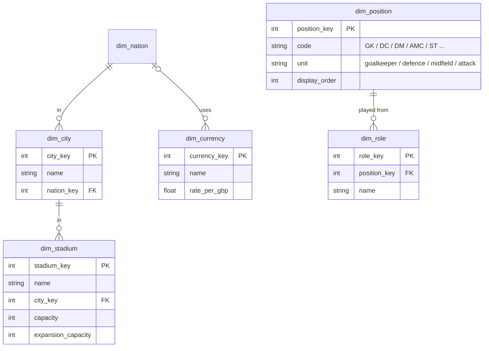

# Reference dimensions — semantic model

Conceptual model only; names are not final tables. The small lookup dimensions the other models
join to. None has facts of its own.

| Dimension | Holds | Used by |
|---|---|---|
| `dim_position` | position code, **unit** (goalkeeper / defence / midfield / attack), display order | position played (`fact_player_match`), training focus position. Positional ratings stay columns on the player snapshot. The unit means no query re-encodes "which positions are midfield". |
| `dim_role` | role name, the position it is played from | training focus role, and anything else that names a role. The save gives role ids only; this puts the names in the warehouse. |
| `dim_city` | name, nation | stadiums, a nation's capital, where a club is based |
| `dim_stadium` | name, city, capacity, expansion capacity | matches, a club's ground (club snapshot), a nation's national stadium |
| `dim_currency` | name, exchange rate to GBP | **optional.** Parsed, but money in the save is already in one currency; model it only if comparing money across nations turns out to need it. |

Lookups that belong to one model stay in that model: `dim_event_type` and `dim_period` (match),
`dim_award` (person), `dim_formation` (match).
